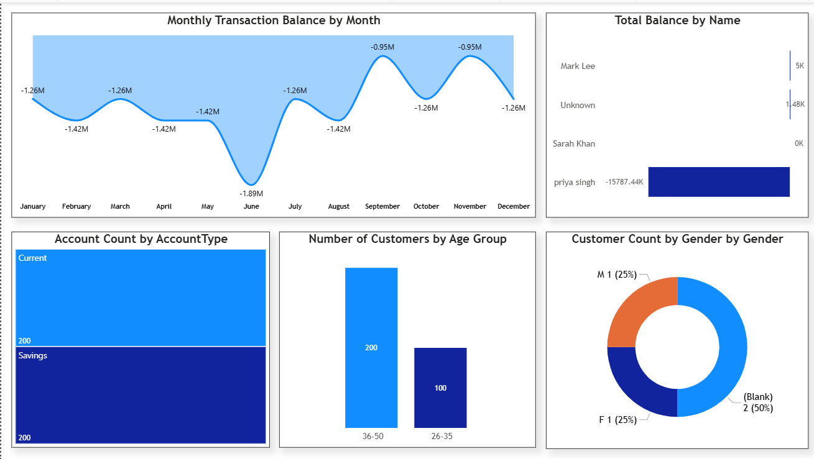

# Banking Power BI Project

This project provides a comprehensive Power BI dashboard solution for analyzing banking data. It offers insights into key performance indicators (KPIs), customer behavior, and overall financial performance.

## Features and Functionality

*   **Interactive Dashboards:**  Provides dynamic dashboards to visualize key banking metrics.
*   **Data Analysis:** Enables in-depth analysis of customer demographics, transaction patterns, and loan performance.
*   **KPI Tracking:**  Monitors essential KPIs such as customer acquisition cost, loan default rates, and customer lifetime value.
*   **Report Generation:** Generates insightful reports based on the analyzed data.
*   **Data Visualization:**  Offers a range of visualizations, including charts, graphs, and maps, to present data effectively.

## Technology Stack

*   **Power BI:** Data visualization and business intelligence tool.

## Prerequisites

To use this project, you will need:

*   **Power BI Desktop:**  Installed on your machine.  Download the latest version from the [Microsoft Power BI website](https://powerbi.microsoft.com/desktop/).
*   **Data Source:** Access to the underlying banking data.  This project assumes the data is accessible and formatted appropriately for Power BI. (Further data formatting information should be provided if the specific data format is known).
*   **(Optional) Power BI Service Account:** If you plan to publish and share your reports through Power BI Service, you will need an account with appropriate permissions.

## Installation Instructions

1.  **Clone the Repository:**

    ```bash
    git clone https://github.com/utkarsh2387/Banking-PowerBI-project-.git
    cd Banking-PowerBI-project-
    ```

2.  **Open the Power BI Project:**

    *   Launch Power BI Desktop.
    *   Navigate to the cloned repository directory.
    *   Open the `.pbix` file (the Power BI project file). If there is not a .pbix file then there are no report files within the repo and it will need to be created.

3.  **Configure Data Connections:**

    *   In Power BI Desktop, go to `File` -> `Options and settings` -> `Data source settings`.
    *   Select the data source(s) used in the project.
    *   Edit the credentials and connection string to point to your actual data source. You will need to know the type of database, server address, database name, and authentication method.  For example, for a SQL Server database:
        *   **Data source type:** SQL Server database
        *   **Server:** `your_server_address`
        *   **Database:** `your_database_name`
        *   **Authentication:** Windows or Database credentials

4.  **Refresh the Data:**

    *   Click on the "Refresh" button in the Power BI Desktop ribbon to load the data into the reports.
  

# 📈 Sample Visuals
###   Dashboard Overview



## Usage Guide

1.  **Navigate the Dashboards:** Use the tabs at the bottom of the Power BI Desktop window to navigate between different dashboards and reports.
2.  **Interact with Visualizations:** Click on charts, graphs, and other visualizations to filter and drill down into the data.
3.  **Use Slicers and Filters:**  Use the slicers and filters on the dashboards to focus on specific segments of the data, such as particular customer groups or time periods.
4.  **Analyze KPIs:**  Monitor the KPIs displayed on the dashboards to track the overall performance of the banking operations.
5.  **Customize Reports (Optional):**  If needed, you can customize the reports by adding or modifying visualizations, calculated columns, and measures.  Refer to the Power BI Desktop documentation for more information on customization options.
6.  **Publish to Power BI Service (Optional):** If you have a Power BI Service account, you can publish the report to the service to share it with others.  Click on "Publish" in the Power BI Desktop ribbon and follow the instructions.

## API Documentation

This project does not directly expose an API. It uses Power BI's built-in data connectivity features to connect to various data sources.  If you require an API to access the underlying data, you will need to consult the documentation for your specific data source (e.g., the API documentation for your banking database).

## Contributing Guidelines

Contributions to this project are welcome! To contribute:

1.  Fork the repository.
2.  Create a new branch for your feature or bug fix.
3.  Make your changes and commit them with clear, descriptive messages.
4.  Submit a pull request to the `main` branch.

Please ensure that your code adheres to the project's coding standards and includes appropriate documentation.

## License Information

This project is licensed under the [Specify License Here, e.g., MIT License] - see the [LICENSE](LICENSE) file for details. If no LICENSE file exists, it is recommended to create one and choose an appropriate license for the project.

## Contact/Support Information

For questions or support, please contact [Your Name] at [Your Email Address].
